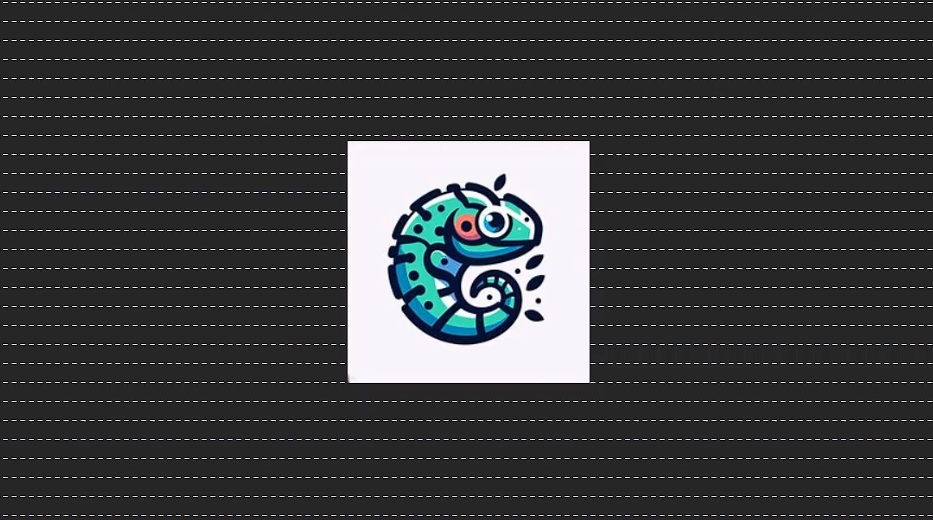
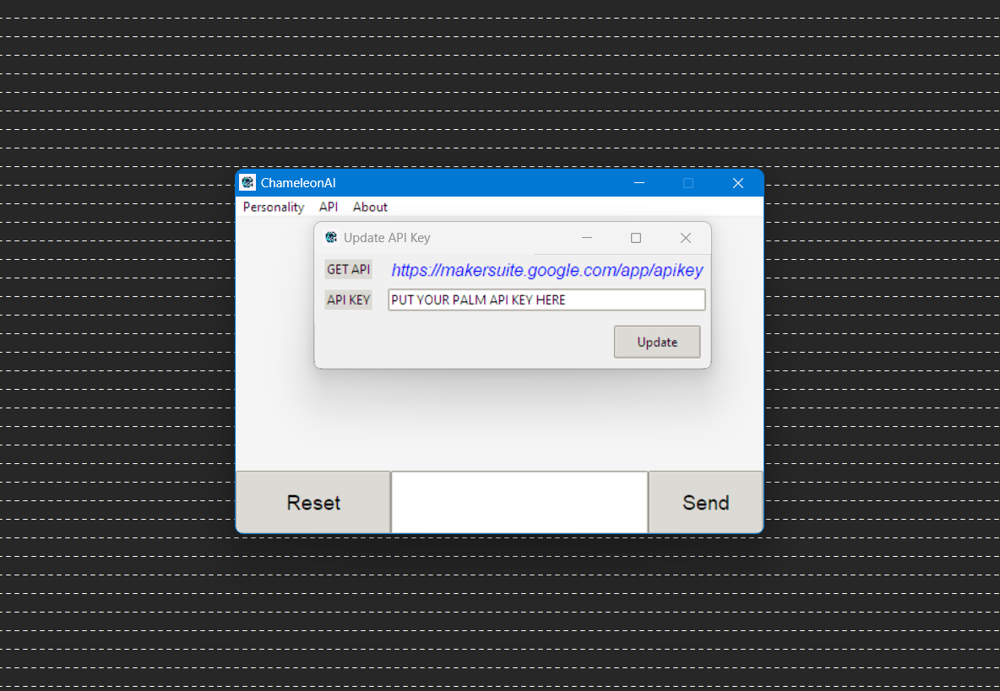
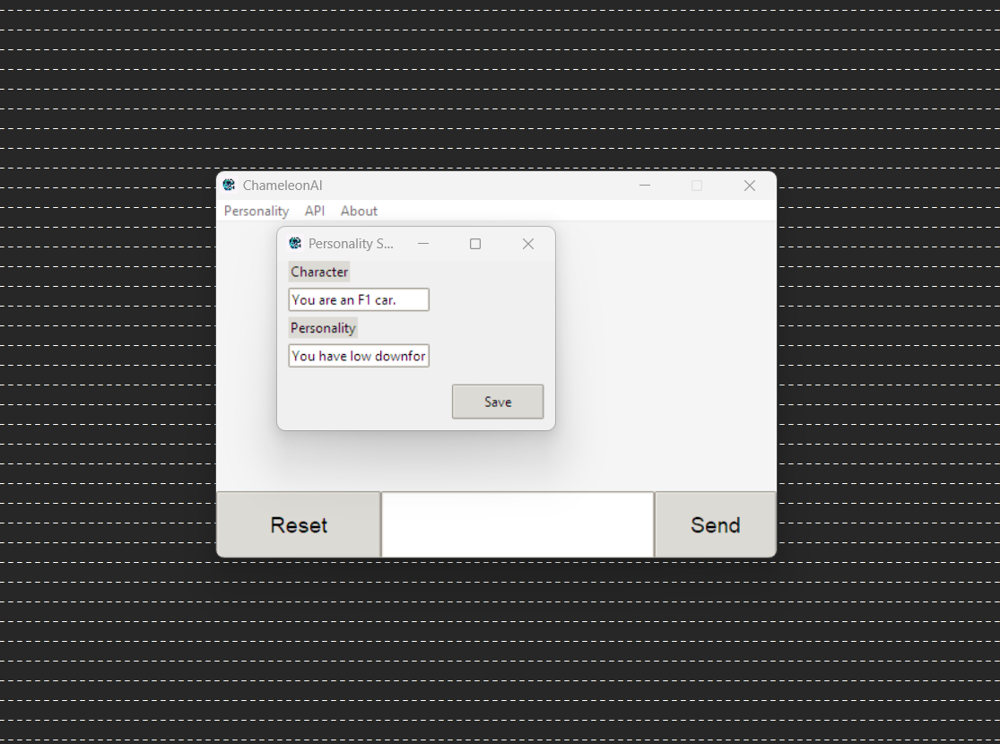

<h1 align="center">ChameleonAI</h1>

  

  Welcome to <b>ChameleonAI</b>, your very own, customizable roleplaying AI chatbot. Powered by Google's state-of-the-art PALM Generative AI Model, you get to talk to anything, anyone, anywhere!

<h2>Features</h2>
<ul>
  <li><b>Set up the API:</b> Simply set up the API and you're good to go. Check out the setup guide below for more details.</li>
  <li><b>Customizable Personality:</b> Give your chatbot a personality of its own! You can customize it to your liking.</li>
  <li><b>Easy Access:</b> ChameleonAI is a floating window that always stays on top of other applications, so you can easily access it whenever you need it.</li>
</ul>

<h2>Setup Guide</h2>
<ol>
  <li><b>API Setup:</b> Follow the instructions in the image below to set up the API.
    

      
    

  </li>
  <li><b>Personality Setup:</b> Follow the instructions in the image below to set up the personality of your chatbot.
    

      
    

  </li>
</ol>

<h2>Introduction Video</h2>

  Check out this introduction video for a quick overview of ChameleonAI.
  <video width="320" height="240" controls>
    <source src="img/ChameleonAI.mp4" type="video/mp4">
  </video>

<h2>File Directory</h2>

<pre>
ChameleonAI/
├── src/
│   ├── main/
│   │   ├── main.py
│   │   ├── brain.py
│   │   ├── save_load.py
│   │   └── ui.py
│   ├── data/
│   │   ├── database.json
│   ├── test/
│   │   └── test.py
├── img
│   ├── cover.png
│   ├── api.png
│   ├── character.png
│   └── ChameleonAI.mp4
├── docs/
│   ├── documentation.txt
├── .gitignore
├── LICENSE
├── README.md
└── requirements.txt

</pre>

  Try ChameleonAI today and explore its amazing capabilities! Happy chatting!

